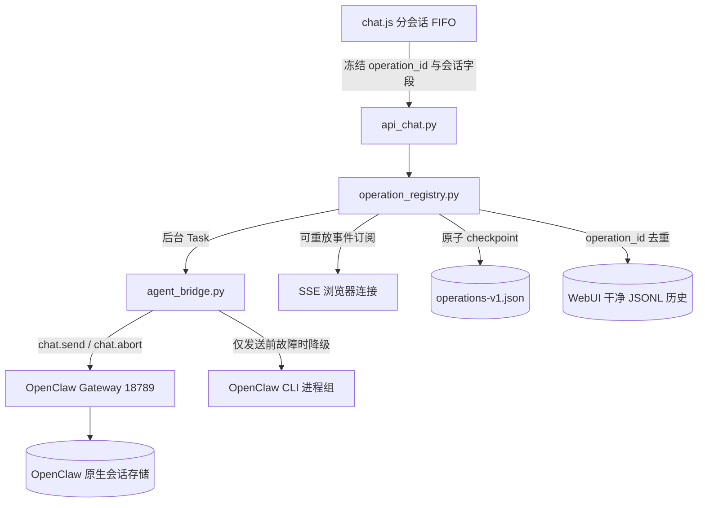

# 🎬 ComfyUI 抽卡控制台 WebUI 对话系统技术架构文档

本案文档详细梳理并规范化记录 ComfyUI 抽卡控制台 WebUI（运行于 `8318` 端口）在对话部分的技术架构、运行机制、多后端分流与物理持久化模型，供日常运维与开发决策参考。

---

## 1. 核心架构与逻辑图层

WebUI 对话系统在架构上分为三个核心图层：**前端交互层**、**接口分流与治理层**、以及**底层执行代理层**。



---

## 2. Operation 协议、隔离与取消

### 2.1 入队快照

前端在入队瞬间生成稳定 `operation_id`，并冻结以下全部字段；真正执行时只读队列项，不再读取可变的 `activeSessionId`、当前卡片或模式：

```json
{
  "operation_id": "UUID",
  "session_id": "draw-session-uuid",
  "chat_mode": "draw",
  "card_id": "optional-card-id",
  "message": "用户原文",
  "include_context": false,
  "confirm": false
}
```

队列以 `session_id` 为键：同一会话 FIFO 串行，不同会话可并行。停止只作用于当前可见会话的活动 operation，不清空任何其它会话的待发项。

### 2.2 生命周期

正常状态链为：

`queued → starting → ws_sent → accepted → streaming → completed`

终态是 `completed / failed / cancelled`；取消分支为 `… → cancelling → cancelled`。
当进程重启或 Gateway 已发送后连接中断、但无法证明最终结果时，状态为非终态
`unknown_remote`。`GET /api/chat/operations/{operation_id}` 返回当前状态、稳定
`run_id`、传输通道、恢复标志和完整 `state_history`；`GET /api/chat/operations?session_id=...`
返回指定会话的 operation 列表。

`POST /api/chat` 创建后台 Task 后，SSE 只是 operation 事件日志的订阅者。浏览器断开只移除订阅，不取消后台 Task；重用完全相同的 `operation_id` 只重放已有事件，不重复执行或重复写历史。

并发取消请求会在 registry 内合并为一次底层控制请求；用户记录和终态助手记录都带
`operation_id` 并原子、幂等写入，写入失败不会伪报 `history_persisted=true`。

### 2.3 精确取消

`POST /api/chat/operations/{operation_id}/cancel` 是唯一对话取消入口：

* Gateway 路径使用独立认证控制连接调用 `chat.abort`，参数为必填 `sessionKey`、精确 `runId=operation_id`、`preserveSideRuns=true`。
* CLI 路径的 PID/PGID 由 operation registry 持有；先向 PGID 发 `TERM`，约 5 秒后仍未退出则发 `KILL`，随后 `await` 回收子进程与输出管道。
* 重启恢复的 Gateway operation 仍可用原 `runId=operation_id` 尝试精确 `chat.abort`；恢复的 CLI operation 不保存也不使用旧 PID/PGID，避免 PID 复用导致误杀。
* Gateway 不支持 `chat.abort` 时返回 `409 cancel_not_confirmed`，不伪报成功、不关闭 SSE，也不改用宽泛 kill。
* 停止按钮必须先收到取消确认，之后才调用本地 `AbortController.abort()` 解除 SSE 订阅。

### 2.4 会话删除

普通 `DELETE /api/chat/sessions/{session_id}` 遇到活动 operation 返回 `409 session_active`。用户二次明确确认后，前端发送 `?cancel_active=true`：后端先 tombstone 会话、精确取消并等待终态，再调用 OpenClaw `sessions.delete`，最后删除本地干净历史。任一步未确认时保留历史并返回错误；tombstone 后 `/api/chat` 与带同名 `session_id` 的 `/api/chat/new` 都拒绝重建。

### 2.5 WebUI 重启恢复

启动时从 `CHAT_HISTORY_DIR/operations-v1.json` 恢复 operation。`completed` /
`failed` / `cancelled` 原样恢复；其余状态统一恢复为 `unknown_remote`，并记录
`recovered_from_state`。系统绝不自动重放旧请求。

Journal 使用同目录临时文件、`fsync` 与 `os.replace` 原子更新，只保存 operation/session/
card、请求指纹、状态历史、传输通道、时间和确认标志；不保存用户消息、助手回复、
SSE 帧、Task、WebSocket 或 CLI 进程对象。损坏 journal 会被隔离为 `.corrupt-*`，
WebUI 安全启动但不会重放其中操作。

恢复态 SSE 只回放一帧 `unknown_remote` 后结束，不悬挂，也不会启动第二个 Task。
前端载入会话时显示“上次运行在重启时中断，远端状态未知”，但不把它伪装成流式中，
用户可以用新的 `operation_id` 重试。

---

## 3. 侧栏会话键 vs CLI 四模式

侧栏只有两态（内部 `chat_mode`（canonical `cards` / `draw`）），**不等于** CLI 四模式开关。四模式入口：

- **常规 create**：在「抽卡」(`draw`) 对话里让 Agent 按 `card_cli --help` 执行
- **连抽 chain**：`#view-chain` → `POST /api/cards/chain`
- **直投 direct**：输入框旁闪电 / `#view-direct` → `POST /api/direct/submit`
- **精选 featured**：输入框旁骰子 → `POST /api/featured`

| 内部键 | UI 文案 | 英文 | 提示词注入 | 发送行为 |
| :--- | :--- | :--- | :--- | :--- |
| **`cards`**（旧 `single`） | **卡片** | **Cards** | **不注入** | 展示/管理；发送 → 交接：切 `draw` + 新会话 + 可选 `include_card_context` + `card_id` |
| **`draw`**（旧 `raw_llm`） | **抽卡** | **Draw** | 首轮极简 `DRAW_ASSISTANT_RULES`（人设 / CLI help / 禁泄密）；后续轮不重灌 | 真 AI 对话；卡片 JSON 仅交接首条注入 |
| **`chain` / `direct`** | （配置兼容） | — | 主路径不靠聊天注入长规则 | 走专页 / HTTP API |

> 可见名 **卡片 / Cards** 与 **抽卡 / Draw**；内部键 canonical 为 `cards` / `draw`。读写时 `normalize_chat_mode()` 兼容旧键 `single`→`cards`、`raw_llm`→`draw`。

---

## 4. 运行执行后端 (Execution Backends)

桥接模块 [agent_bridge.py](../../scripts/webui/agent_bridge.py) 负责与 OpenClaw 通信。

### OpenClaw Gateway（首选）
* **WebSocket 通信（首选）**：
  使用本机设备私钥完成认证，建立 `ws://127.0.0.1:18789` 连接。`operation_id` 同时作为 `chat.send.idempotencyKey` 与预期 `runId`。桥接器必须同时读到匹配 `runId` 的 `chat.send` ACK 与 `final` 事件才算正常结束（两者到达顺序不限）；从 `ws_sent` 起，即使断线也禁止 CLI 创建新 run。
* **CLI 降级机制**：
  仅在 `chat.send` 尚未尝试发送时允许。使用 `asyncio.create_subprocess_exec(..., start_new_session=True)`，PID/PGID 与 operation 绑定。

---

## 5. 对话持久化与文件存储模型 (Persistence Model)

WebUI 只维护一份用于展示的干净历史；OpenClaw 自己维护模型执行上下文：

```
~/.openclaw/
└── webui-chat/
    ├── {card_id}.jsonl                 - 卡片页展示历史
    ├── {session_id}.jsonl              - 抽卡页 UUID 会话历史
    └── operations-v1.json              - 无聊天正文的 operation 原子 journal
```

* **路径**：`~/.openclaw/webui-chat/`
* **落盘时机**：`user` 在后台 operation 开始时原子写入；`assistant` 在明确终态时写入。两者均以 `operation_id + role` 去重，SSE 重连、重复订阅或相同 `operation_id` 重试不会重复追加。结果未知时不会伪造助手终态。
* **执行上下文**：由 OpenClaw 以 `agent:main:explicit:{session_id}` 为 session key 独立维护；源码库不再创建 `scripts/webui/sessions/` 标记文件。

---

## 6. 提示词动态注入与清理机制 (Injection & Cleaning)

### ① 动态单次注入控制
* **`cards`（卡片，兼容旧 `single`）**：`get_chat_rules` 恒为空；不走长规则包。
* **`draw`（抽卡，兼容旧 `raw_llm`）**：首轮注入极简 `DRAW_ASSISTANT_RULES`；`should_inject_full_rules()` + `/tmp/cu-card/webui-rule-session.json` 保证同一会话只灌一次。
* **卡片上下文**：仅当请求 `include_card_context: true`（交接首条）时拼接 `[Card:…]` 摘要，不每轮刷整卡。
* 不再默认灌 `WORKFLOW` / `DRAW_GUIDE` / `PROMPT_TEMPLATE` 全文；细节以 CLI `--help` 为准。

### ② 用户消息清洗与去噪
当大模型输出后，[prompt_rules.py](../../scripts/webui/prompt_rules.py) 中的 `clean_user_message()` 函数会在记录“干净历史文件”前对文本执行系统级去噪过滤：
* 剔除 `<relevant-memories>` 全文记忆标记块。
* 剔除所有已被注入到大模型输入中的 `[Core Rules]`、`[Direct Submit Rules]` 以及系统级 markdown 工作流规则文档，仅保存用户原生在输入框中打入的真正文本。

---

## 7. 对话系统关键源代码索引

* 💻 [api_chat.py](../../scripts/webui/api_chat.py)
  * `/api/chat` — 创建/复用 operation 并返回 SSE 订阅。
  * `/api/chat/operations/{id}` — 单 operation 状态查询与精确取消。
  * `/api/chat/operations?session_id=...` — 按会话查询恢复状态。
  * `/api/chat/sessions/{id}` — 活动检查、cancel-and-delete 与 tombstone。
* 💻 [operation_registry.py](../../scripts/webui/operation_registry.py)
  * 冻结请求、状态机、原子 journal、重启恢复、订阅解耦与 exactly-once guard。
* 💻 [agent_bridge.py](../../scripts/webui/agent_bridge.py)
  * `chat.send` ACK/runId 跟踪、独立 `chat.abort` 控制连接。
  * CLI 进程组登记、TERM/KILL 与回收。
* 💻 [prompt_rules.py](../../scripts/webui/prompt_rules.py)
  * `get_chat_rules` — 根据模式组装绘图指令包。
  * `clean_user_message` — 系统杂质消息去噪。
* 💻 [chat.js](../../scripts/webui/static/js/chat.js)
  * 分会话 FIFO、冻结快照、SSE 渲染与停止确认。

无外部服务回归命令：

```bash
# 在 zip/仓库根目录执行（Python 必须和 zip 标签一致：`cp39`→3.9，`cp312`→3.12）。下列 tests/ 仅 skill 开发树提供，发行包不含。
node --check scripts/webui/static/js/chat.js
```

## 8. 当前限制

* `unknown_remote` 只表示“本地无法证明远端结果”，不等于远端仍在运行，也不等于失败；除 Gateway 精确取消外，系统不会猜测或自动续跑。
* Gateway 在 `ws_sent` 后断线时不会自动重放；这是为避免卡片/渲染副作用重复而做的安全取舍。
* 精确取消依赖 OpenClaw `chat.abort`。能力缺失时系统保持 operation 的未确认状态并明确返回 `409`，需要升级 Gateway 后才能真实取消。
